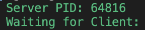

# minitalk

[](LICENSE)

A simple, Norm-compliant pair of C programs (`server` and `client`) that communicate text messages via UNIX signals.

## Table of Contents

- [About](#about)  
- [Features](#features)  
- [Installation](#installation)  
- [Usage](#usage)  
- [Example](#example)  

`minitalk` implements inter-process communication by encoding each byte of your message into a sequence of `SIGUSR1` and `SIGUSR2` signals.  
The **server** listens for incoming signals, reconstructs the bytes, and prints the received message to stdout.  
The **client** takes the server’s PID and your message string, then sends it bit by bit using signals.

## Features
- **Signal-based IPC**: Uses `kill()` to send `SIGUSR1` and `SIGUSR2`.  
- **Bitwise encoding**: Transmits each character one bit at a time. 
- **Acknowledgements**: Server sends a confirmation signal back after each byte.  
- **Graceful exit**: Client and server handle unexpected terminations cleanly.  
- **Norm-compliant**:  
  - Only permitted functions
  - 25 lines max per function.  
  - 80-column width limit.  
  - Max 4 functions per file.  
  - Max 4 parameters per function.  

## Installation

1. **Clone the repo**
   ```bash
   git clone https://github.com/YourUsername/minitalk.git
   cd minitalk
   ```
2. Compile
   ```bash
   make
   ```

## Usage

1. Start the Server
   ```bash
   ./server
   ```
   

2. Use a seccond terminal window for the client to send a message to Server, use the Servers PID that is shown from Server
   ```bash
   ./client 64816 "Hello World"
   ```
   
Server will recive the message and wait for more signals
   
